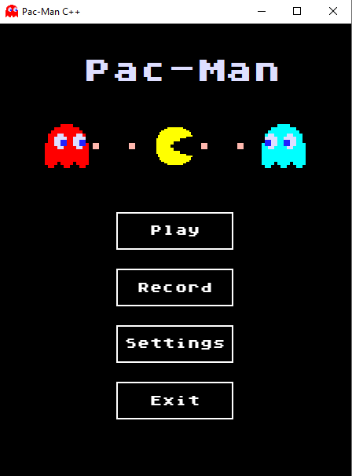
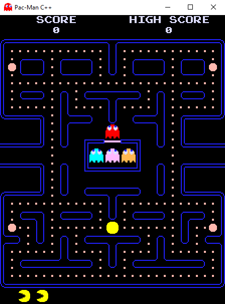
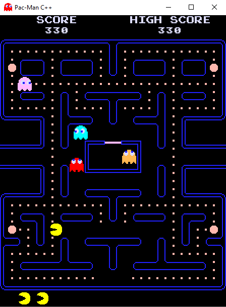
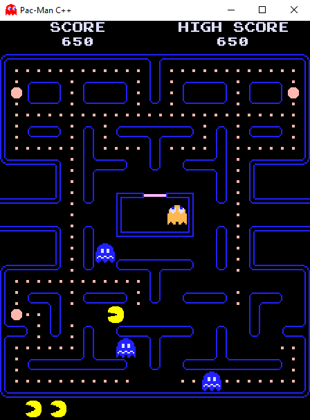
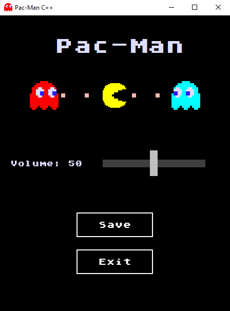

# Pac-Man-CPP
#### Clone of the famous Pac-Man game, written in C ++, SFML v2.5.1
#### Everything was recreated, except for the rule for ghosts to leave the house and fruits
---
#### The game is based on state. The Player and Ghost classes are inherited from the Entity class. Classes Blinky, Pinky, Clyde, Inky inherit from the Ghost class.
---
# Screenshots:

